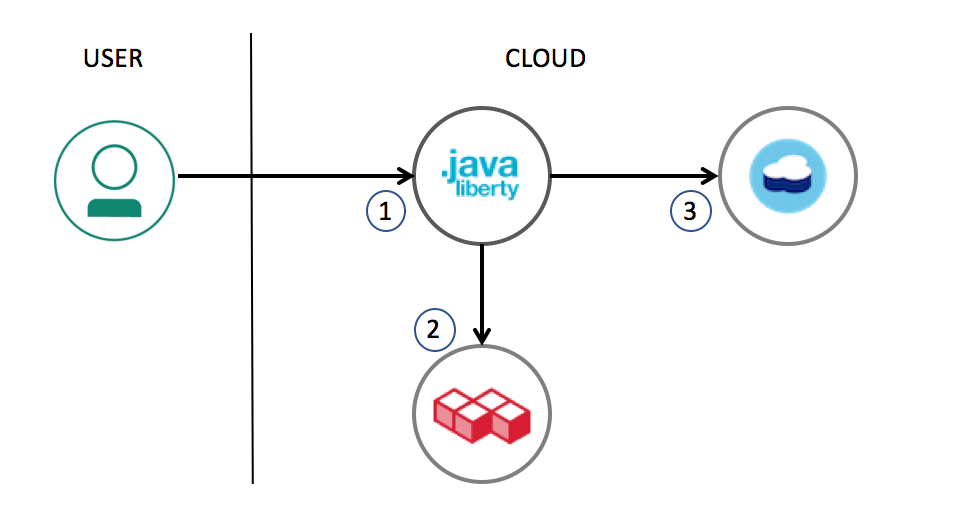
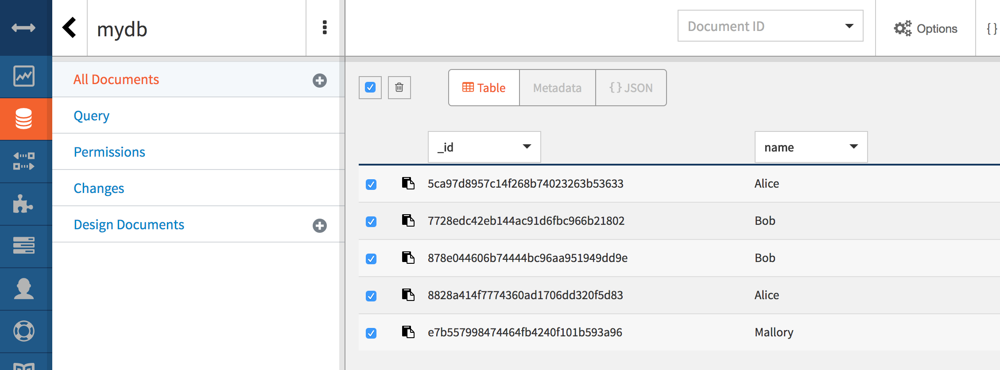
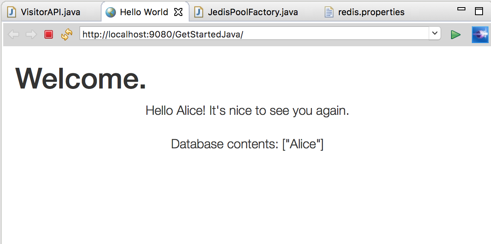

# Liberty on Bluemix getting started application
The Bluemix Getting started tutorial for Liberty uses this sample application to provide you with a sample workflow for working with any Liberty app on Bluemix; you set up a development environment, deploy an app locally and on Bluemix, and integrate a Bluemix database service in your app.

The Liberty app uses the [Cloudant Java Client](https://github.com/cloudant/java-cloudant) to add information to a database and then return information from a database to the UI.

<p align="center">
  <kbd>
    
  </kbd>
</p>

The following steps are the general procedure to set up and deploy your app. See more detailed instructions in the [Getting started tutorial for Liberty](https://console.bluemix.net/docs/runtimes/liberty/getting-started.html#getting-started-tutorial).

## Before you begin

You'll need a [Bluemix account](https://console.ng.bluemix.net/registration/), [Git](https://git-scm.com/downloads) [Cloud Foundry CLI](https://github.com/cloudfoundry/cli#downloads) and [Maven](https://maven.apache.org/download.cgi) installed.

## Extending this sample to use Compose for Redis

This demonstration application has a behavior that could be improved with some very simple application logic. When entering the same name twice, the application will add the name to the database a second time. How can we make this better and provide an example of combining a caching service with a data service like Cloudant?

In this lab, you'll change the code to use Redis as a cache, either locally or using the Compose for Redis service on Bluemix. When complete, the application architecture will look like:



1.  User provides name for the app
2.  App checks Redis cache to see if name has already been added
3.  If name hasn't been added, store name in Cloudant

## Step 1 - Get the code and import into Eclipse

1.  If you don't already have a copy of the base code for this example, clone a copy to your workstation. If you already have the code and set up Eclipse in a previous lab, skip on to the next section.

    ```bash
    git clone https://github.com/IBM-Bluemix/get-started-java
    ```

    > For developing and deploying with Eclipse, IBM® Eclipse Tools for Bluemix provides plug-ins that can be installed into an existing Eclipse environment to assist in integrating the developer's integrated development environment (IDE) with Bluemix.

    >  - Download and install  [IBM Eclipse Tools for Bluemix](https://developer.ibm.com/wasdev/downloads/#asset/tools-IBM_Eclipse_Tools_for_Bluemix).

2.  Import this sample into Eclipse using `File` -> `Import` -> `Maven` -> `Existing Maven Projects` option.

3.  Create a Liberty server definition:
  - In the `Servers` view right-click -> `New` -> `Server`
  - Select `IBM` -> `WebSphere Application Server Liberty`
  - Choose `Install from an archive or a repository`
  - Enter a destination path (/Users/username/liberty)
  - Choose `WAS Liberty with Java EE 7 Web Profile`
  - Continue the wizard with default options to Finish

4.  Run your application locally on Liberty:
  - Right click on the `GetStartedJava` sample and select `Run As` -> `Run on Server` option
  - Find and select the localhost Liberty server and press `Finish`
  - In a few seconds, your application should be running at http://localhost:9080/GetStartedJava/

## Step 2 - Add a Maven dependency for the Jedis Redis client.

1.  Use Eclipse to edit the `pom.xml` file to add a Maven dependency to include Jedis. Right after the `javax.ws.rs` dependency and before the closing `</dependencies>` tag, add the following and then save the file:

    ```
    <dependency>
      <groupId>redis.clients</groupId>
      <artifactId>jedis</artifactId>
      <version>2.9.0</version>
    </dependency>
    ```
## Step 3 - Update the API endpoint class
In this step, you'll add a little bit of code to adjust the backend logic used by the application to work with Redis as a cache. Open the `src/main/java/wasdev/sample/rest/VisitorAPI.java` file.

1.  Add imports for Jedis and JedisPool. These can go in at line 31, appending before the `import wasdev...` statements.

    ```java
    import redis.clients.jedis.Jedis;
    import redis.clients.jedis.JedisPool;
    import wasdev.sample.store.JedisPoolFactory;
    ```

2.  Copying the style of the example, add after the statement to retrieve the `VisitorStore` instance on line 44, a statement that retrieves the `JedisPool` instance.

    ```java
    //Our database store
    VisitorStore store = VisitorStoreFactory.getInstance();

    //Get instance of our Jedis pool
    JedisPool pool = JedisPoolFactory.getInstance();
    ```

3.  Update the code in the `newToDo` method marked with the `@POST` annotation to perform some checking when a `store` is available for persisting visitors. Starting near line 113, *replace* the original code:

    ```java
    store.persist(visitor);
    return String.format("Hello %s! I've added you to the database.", visitor.getName());
    ```

    With code that will get a Jedis instance from the pool, and see if a user has already been added. If so, send a modified greeting. If not, persist the user to the store and add the user name as a key to the cache.

    ```java
    try (Jedis jedis = pool.getResource()) {
        /// check to see if this user is already in the cache
        if ( jedis.get(visitor.getName()) != null ) {
          return String.format("Hello %s! It's nice to see you again.", visitor.getName());
        }
        store.persist(visitor);
        jedis.set(visitor.getName(),"persisted");
        return String.format("Hello %s! I've added you to the database.", visitor.getName());

    } catch (Exception e) {
      // land here if there is no Redis service, implement default behavior
      store.persist(visitor);
      return String.format("Hello %s! I've added you to the database.", visitor.getName());
    }
    ```

    > For the case of a cache hit, this change to the code avoids the cost of persisting the same data to the data store additional times. Jedis implements Closeable, so it will be auto-closed after the return or the last statement in the `try`. In the case where no Redis service is available, the catch on the exception defaults to the original behavior.

4.  Save the edits to the file. At this point, there will be errors reported by Eclipse since the factory method has not been created so **Cancel** instead of redeploying the application to Liberty if it is currently running.

## Step 4 - Add a factory to create a Jedis connection pool
This step is quite a bit more involved and if you are pressed for time you can alternatively [download a working copy](src/main/java/wasdev/sample/store/JedisPoolFactory.java) from the repository with this lab and add it to the `src/main/wasdev/sample/store` folder. Then move on to Step 5.

1.  Begin by copying the `VisitorStoreFactory.java` class to a class file called `JedisPoolFactory.java`. Add in imports after the `package` statement.

    ```java
    package wasdev.sample.store;

    import java.net.URI;
    import java.net.URISyntaxException;

    import com.google.gson.JsonObject;

    import redis.clients.jedis.JedisPool;
    ```

2. Rename the class to `JedisPoolFactory` and replace the constructor for the class.

    ```java
    public class JedisPoolFactory {

    	private static JedisPool pool;
    	static {
    		try {
    			JedisPool jp = new JedisPool(getRedisURI());
    			pool = jp;
    		} catch (Exception e) {
    		    pool = null;
    		}
    	}
    ```

    > To keep the code changes simple, we will add to this factory class the `getRedisURI` method for creating a URI to use in the `JedisPool` constructor.

3.  Update the `getInstance` method to return the `JedisPool`

    ```java
    public static JedisPool getInstance() {
      return pool;
    }
    ```

4.  Using a slightly modified version of the code from `CloudantVisitorStore.java`, obtain the credentials for the Redis instance and provide them as a `URI` object. You will see in `CloudantVisitorStore.java` that this code block returns a `String`, but for the `JedisPool` constructor, a `String` argument is only parsed for a hostname, and not interpreted as a full url. Add after the `getInstance` method:

    ```java
    private static URI getRedisURI() {
      String url;
      URI uri;

      if (System.getenv("VCAP_SERVICES") != null) {
        // When running in Bluemix, the VCAP_SERVICES env var will have the credentials for all bound/connected services
        // Parse the VCAP JSON structure looking for redis.
        JsonObject redisCredentials = VCAPHelper.getCloudCredentials("redis");
        if(redisCredentials == null){
          System.out.println("No redis cache service bound to this application");
          return null;
        }
        url = redisCredentials.get("uri").getAsString();
      } else {
        System.out.println("Running locally. Looking for credentials in redis.properties");
        url = VCAPHelper.getLocalProperties("redis.properties").getProperty("redis_url");
        if(url == null || url.length()==0){
          System.out.println("To use a database, set the Redis url in src/main/resources/redis.properties");
          return null;
        }
      }
      try {
        uri = new URI(url);
          return uri;
      } catch (URISyntaxException e) {
        // TODO Auto-generated catch block
        e.printStackTrace();
        return null;
      }
    }
    ```

5. Don't forget to keep the closing `}` at the end of the `JedisPoolFactory` class definition and save the file.

## Step 5 - add the properties file for use when running locally.

1.  Copy the `src/main/resources/cloudant.properties` file to `src/main/resources/redis.properties` and update line 3 to: `redis_url=`

    > Since this will be parsed as a full URI, if you want to use a local copy of redis, instead of providing `localhost` as the value, set it to be `redis://localhost:6379/`

## Step 6 - test the code locally

1.  There should be no code errors after all of the updates are complete and the local Liberty server should automatically refresh. Access the application at http://localhost:9080/GetStartedJava

2.  Add a user in the application. And then add a user of the same name. Since there is no Redis service defined, duplicates will still be successful.

3.  Go to the Cloudant dashboard for the service, select all of the documents in the `mydb` database and then delete them:

    

4.  Create a Redis instance. Either start a local copy of Redis and update `redis.properties` with the value `redis://localhost:6379/` or create a Compose for Redis service instance in Bluemix using the service catalog and copy the credentials to the `redis.properties` file.

5.  After updating the `redis.properties` file, restart the application on Liberty.

6.  Use the application again. Try to use the same name twice.

    

## Step 7 - publish to Bluemix

1.  With the application working correctly, select the application from the navigator and select **Run As**->**Maven install** to build and updated version of the war file.

2.  If you have created a Compose for Redis service on Bluemix, publish the application to Bluemix. When using the Add application tool, select both the Cloudant and Redis services provisioned in Bluemix.

3.  Check status on the Bluemix dashboard, and then access the application to test it out. If you need to re-synchronize the cache and Cloudant instances, use the redis command-line shown in the service manage panel and the `flushdb` command to remove all inserted keys. Then from the Cloudant dashboard, remove all documents from `mydb`.
